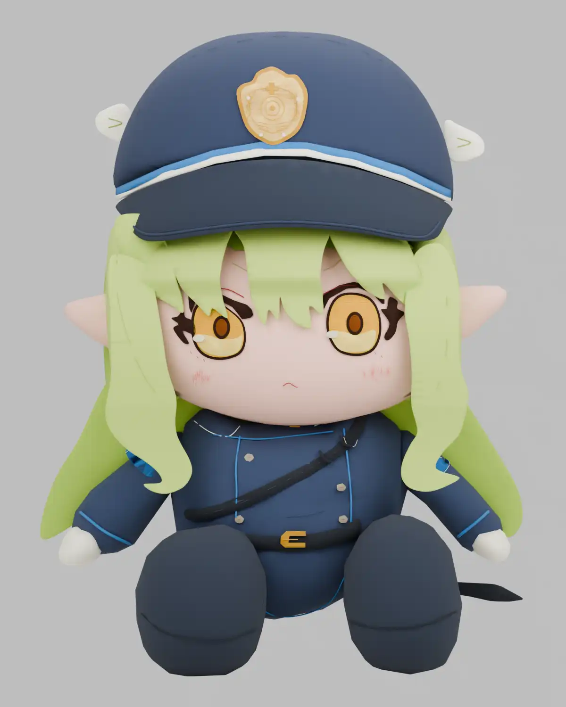
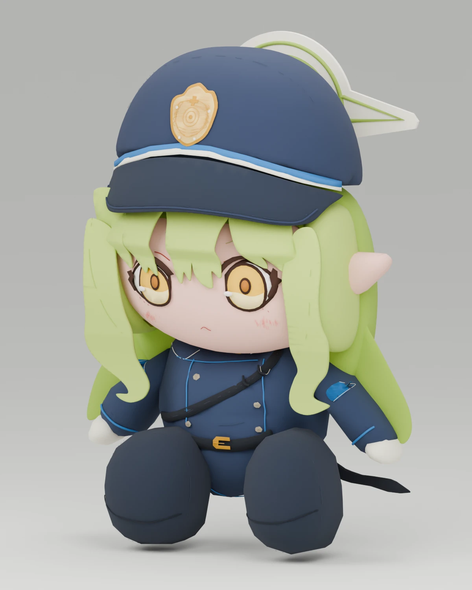

# Blue Archive Chocopuni Demake

| [original](https://www.amiami.com/eng/detail/?gcode=GOODS-04779988)    | front                     | side                              |
| ---------------------------------------------------------------------- | ------------------------- | --------------------------------- |
|  |  |  |

- recreates [hikari chocopuni](https://www.amiami.com/eng/detail/?gcode=GOODS-04779988) as a blender model using [GPT-6](https://openai.com/index/gpt-6-astra/) astra high
- model has around 7000 vertices

## Posing

Open `hikari_chocopuni.blend`, select `HIKARI | pose rig`, and enter Pose Mode.
Rotate `spine`, `neck`, `head`, or the arm and leg bones to pose the plush;
`root` moves the whole character. Hair locks, ears, and the loose belt end have
their own bones. The sewn face, cap, and embroidery follow their body parts.
Select all pose bones and clear their location, rotation, and scale to reset.

The rig uses forward kinematics: pose shoulders/hips before elbows/knees and
hands/feet. Sleeves bend at the elbows; the short stuffed shoes stay rigid.
`L` and `R` retain the original front-view component labels. There are no
individual finger or facial expression controls.

To add the same rig to an unrigged sewn model:

```sh
blender --background hikari_chocopuni.blend --python rig_hikari.py
```

This saves the open file and refuses to overwrite an existing rig.

Validate the rig with `blender --background hikari_chocopuni.blend --python-exit-code 1 --python test_hikari_rig.py`.

## Disclaimer (저작권 고지)

본 프로젝트는 비영리 목적의 개인 팬 프로젝트입니다.

- 블루 아카이브 및 관련 자산(이미지, 오디오 등)의 모든 저작권과 권리는 Nexon Games Co., Ltd. 및 Yostar, Inc., **Nexon Korea Corp.**에 귀속됩니다.
- 본 프로젝트는 해당 저작권자들과 어떠한 공식적인 관계도 없으며, 원작의 가치를 훼손할 의도가 없습니다.
- 상업적 목적이 없는 비영리 프로젝트입니다.
- 원저작권자의 요청이 있을 시 즉시 서비스를 종료합니다.

This project is a non-commercial fan work. All assets related to Blue Archive belong to their respective copyright holders (Nexon Games, Yostar, Nexon). This project is not affiliated with the official owners.
License

## License

code: [AGPL-3.0-only](./LICENSE)
non-code assets: CC-BY-SA 4.0
