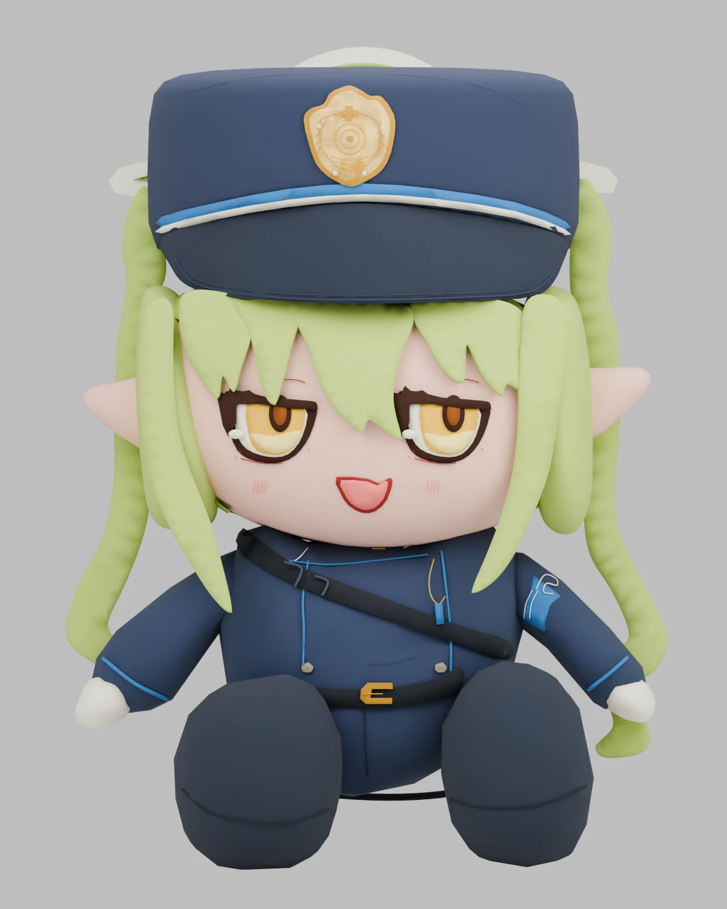
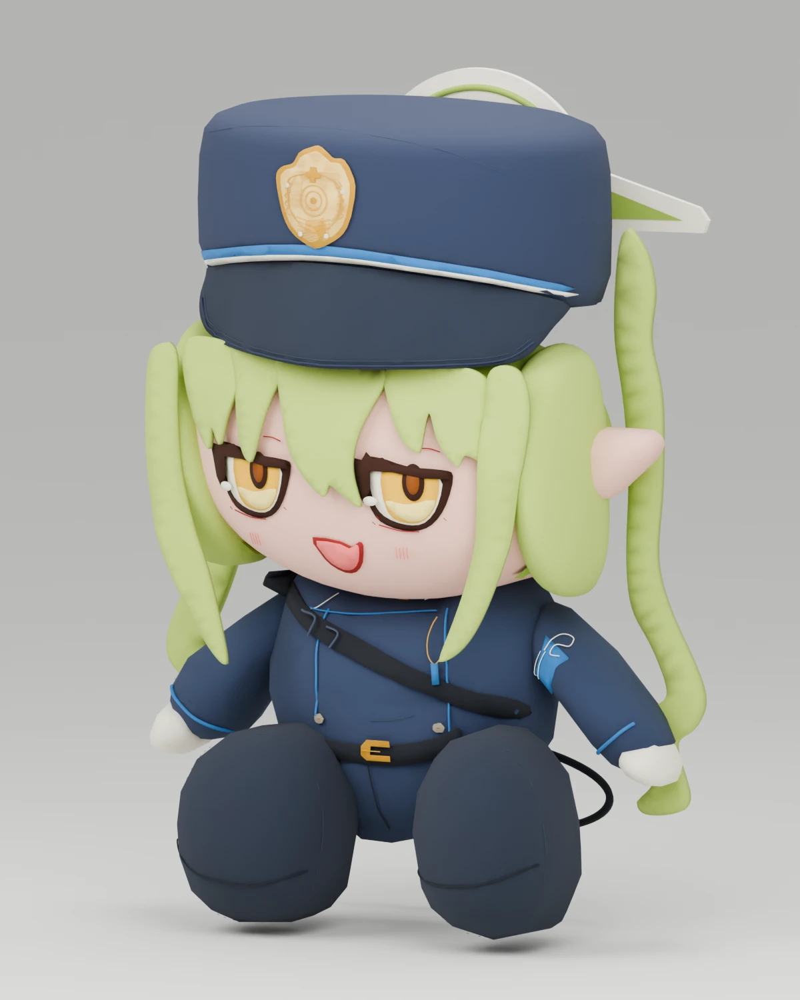
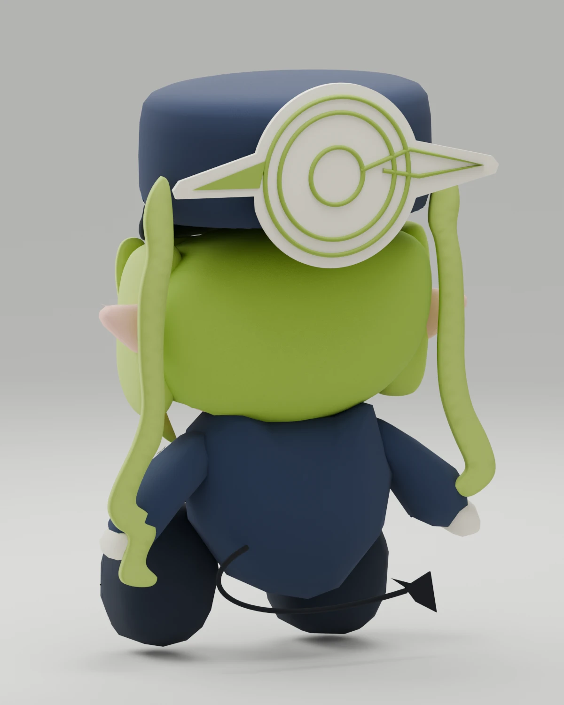
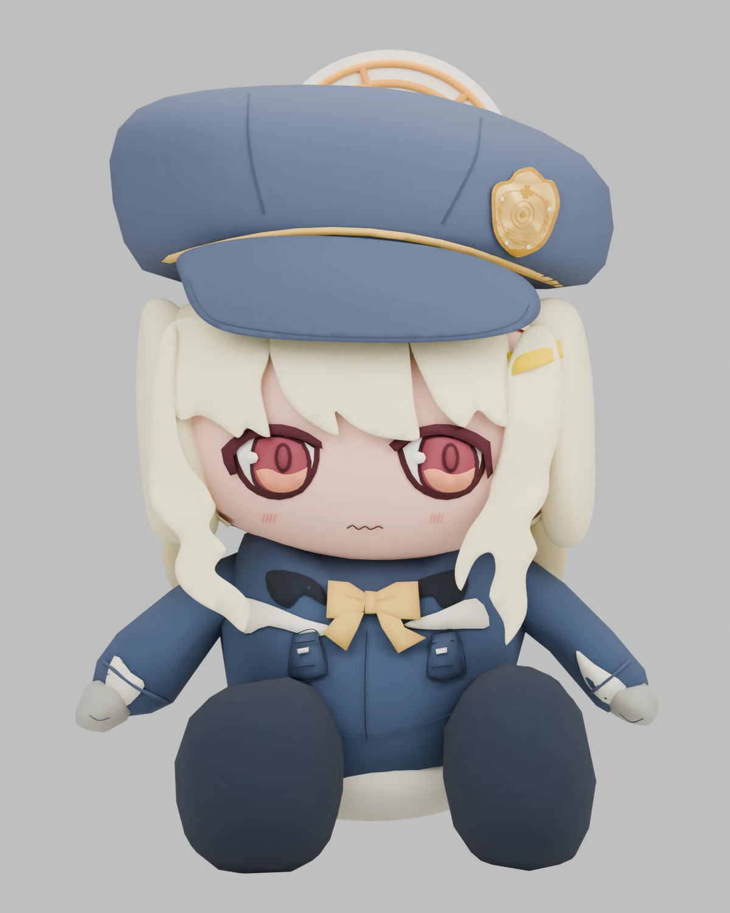
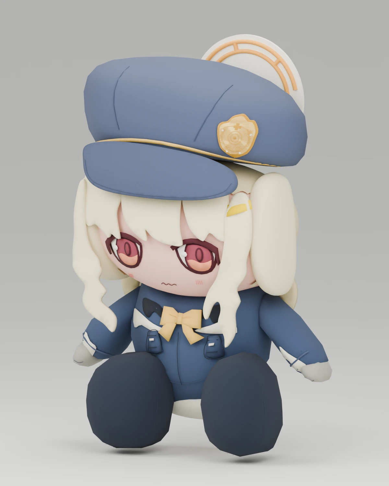
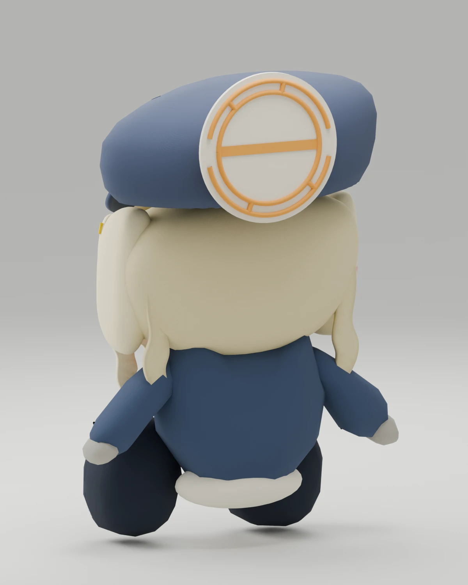

# Blue Archive Chocopuni Demake

| [original](https://www.amiami.com/eng/detail/?gcode=GOODS-04779988)    | front                     | side                              |
| ---------------------------------------------------------------------- | ------------------------- | --------------------------------- |
|  |  |  |

- recreates [hikari chocopuni](https://www.amiami.com/eng/detail/?gcode=GOODS-04779988) as a blender model using [GPT-6](https://openai.com/index/gpt-6-astra/) astra high
- model has around 7000 vertices

The complete felt halo is restored from [the rear cap photograph (image 2)](https://arca.live/b/bluearchive/181993371).
See the [back preview](./preview_back.webp) and [modelling notes](./MODELING.md) for
the reference workflow and the measured v4 geometry reduction.

Hikari's [editable eye pattern](./patterns/hikari_eyes.svg) separates white scleras,
golden irises, pupils and glints. Regenerate its compiled coordinates with
`uv run --python 3.12 vectorize.py prepare patterns/hikari_eyes.svg`, then apply it
with `blender --background hikari_chocopuni.blend --python-exit-code 1 --python
fix_eyes.py -- --student Hikari --output .work/hikari.blend`.
`test_eyes.py` checks actual front-view sclera visibility as well as layer depth.

## Nozomi

| [original](https://www.goodsmile.com/en/product/1140953/Chocopuni+Plushie+Aoba+Hikari+Nozomi) | front | side | back |
| --- | --- | --- | --- |
|  |  |  |  |

Open [nozomi_chocopuni.blend](./nozomi_chocopuni.blend) and pose `NOZOMI | pose rig`.
The twin tails, tapered side locks, half-lidded smile, shorts, reversed shoulder
strap, armband, and mirrored felt halo follow the product and character references.
`belt_tail` controls the pointed tail behind the shorts.

## Aoba

| [original](https://www.goodsmile.com/en/product/1140953/Chocopuni+Plushie+Aoba+Hikari+Nozomi) | front | side | back |
| --- | --- | --- | --- |
|  |  |  |  |

Open [aoba_chocopuni.blend](./aoba_chocopuni.blend) and pose `AOBA | pose rig`.
The cream bob and curls, red eyes, yellow bow and hair clip, soft cap with an
off-centre crest, work jacket, and circular gold halo follow the product and
character references. The rig has 23 controls; Aoba has no tail control.

The [eye pattern](./patterns/aoba_eyes.svg) keeps ivory scleras separate from the
wine/coral irises and uses narrower pupils and rims. `model_aoba.py` applies the
pattern on every rebuild; `test_eyes.py` checks front-view visibility.

## Posing

Open `hikari_chocopuni.blend`, select `HIKARI | pose rig`, and enter Pose Mode.
Rotate `spine`, `neck`, `head`, or the arm and leg bones to pose the plush;
`root` moves the whole character. Hair locks, ears, and the loose belt end have
their own bones. The sewn face, cap, and embroidery follow their body parts.
Select all pose bones and clear their location, rotation, and scale to reset.

The rig uses forward kinematics: pose shoulders/hips before elbows/knees and
hands/feet. Sleeves bend at the elbows; the short stuffed shoes stay rigid.
`L` and `R` retain the original front-view component labels. There are no
individual finger or facial expression controls.

To add the same rig to an unrigged sewn model:

```sh
blender --background hikari_chocopuni.blend --python rig_hikari.py
```

This saves the open file and refuses to overwrite an existing rig.

Validate the rig with `blender --background hikari_chocopuni.blend --python-exit-code 1 --python test_hikari_rig.py`.

Validate Nozomi with `blender --background nozomi_chocopuni.blend --python-exit-code 1 --python test_student_models.py`.
Validate Aoba with `blender --background aoba_chocopuni.blend --python-exit-code 1 --python test_student_models.py`.

To rebuild Nozomi from the Hikari template, download the product photograph and
[character reference](https://static.wikitide.net/bluearchivewiki/8/87/Nozomi_00.png), then run:

```sh
blender --background --factory-startup --python-exit-code 1 --python model_nozomi.py -- --reference nozomi-reference.jpg --character-reference nozomi-character.png
blender --background nozomi_chocopuni.blend --python render_previews.py -- --prefix nozomi_preview
```

For Aoba, use her product photograph and
[character reference](https://static.wikitide.net/bluearchivewiki/4/45/Aoba_00.png):

```sh
blender --background --factory-startup --python-exit-code 1 --python model_aoba.py -- --reference aoba-reference.jpg --character-reference aoba-character.png
blender --background aoba_chocopuni.blend --python render_previews.py -- --prefix aoba_preview
```

Both generators save separate `.blend` files with packed references and reuse the
Hikari template's studio and FK rig. Unseen rear seam placement is marked as
interpreted in each model's root-object notes.

For subsequent builds, omit the reference arguments to reuse packed images and use
`--output .work/aoba.blend` (or `.work/nozomi.blend`) for a candidate. The
[iteration workflow](./MODELING.md#iteration-workflow) covers fast draft renders,
component focus, photo calibration and adaptive curved panels.

## Disclaimer (저작권 고지)

본 프로젝트는 비영리 목적의 개인 팬 프로젝트입니다.

- 블루 아카이브 및 관련 자산(이미지, 오디오 등)의 모든 저작권과 권리는 Nexon Games Co., Ltd. 및 Yostar, Inc., **Nexon Korea Corp.**에 귀속됩니다.
- 본 프로젝트는 해당 저작권자들과 어떠한 공식적인 관계도 없으며, 원작의 가치를 훼손할 의도가 없습니다.
- 상업적 목적이 없는 비영리 프로젝트입니다.
- 원저작권자의 요청이 있을 시 즉시 서비스를 종료합니다.

This project is a non-commercial fan work. All assets related to Blue Archive belong to their respective copyright holders (Nexon Games, Yostar, Nexon). This project is not affiliated with the official owners.
License

## License

code: [AGPL-3.0-only](./LICENSE)
non-code assets: CC-BY-SA 4.0
